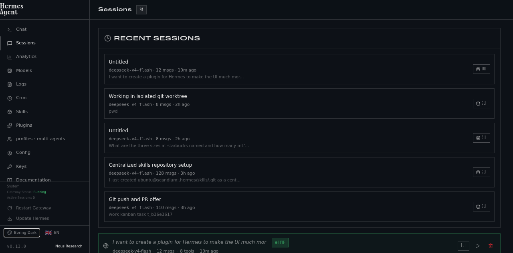
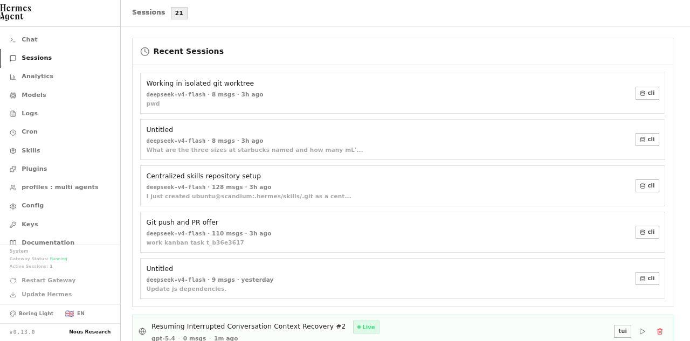

# Hermes Dashboard Themes: Boring Edition

Make the Hermes dashboard look calm, flat, and normal.

These themes remove most of the default dashboard's stylized aesthetic:
- no teal tint
- no noise / grain
- no vignette glow
- no artsy display fonts
- cleaner system UI typography
- flatter dark and light palettes

## Included themes

| Theme | Description |
|---|---|
| `boring-dark` | Flat, silent dark. GitHub-adjacent, low-drama, readable. |
| `boring-light` | Flat, silent light mode. Clean, neutral, and intentionally unstylish. |

## Screenshots

### Boring Dark



### Boring Light



## Install

### Option 1: copy the YAML files manually

Create the theme directory and copy the files into it:

```bash
mkdir -p ~/.hermes/dashboard-themes
cp themes/boring-dark.yaml ~/.hermes/dashboard-themes/
cp themes/boring-light.yaml ~/.hermes/dashboard-themes/
```

Then set one as your default theme:

```bash
hermes config set display.dashboard_theme boring-dark
```

Or choose it from the dashboard's **Switch theme** menu.

### Option 2: install from GitHub

Users can install directly from GitHub with:

```bash
curl -fsSL https://raw.githubusercontent.com/sorenisanerd/hermes-dashboard-themes/main/scripts/install.sh | bash
```

To default to light mode instead:

```bash
curl -fsSL https://raw.githubusercontent.com/sorenisanerd/hermes-dashboard-themes/main/scripts/install.sh | bash -s boring-light
```

## How Hermes themes work

Hermes loads user themes from:

```bash
~/.hermes/dashboard-themes/*.yaml
```

No plugin is required.

Once the files are present, they appear in the dashboard theme switcher alongside the built-in themes.

## What these themes change

These themes mainly work by overriding:
- the dashboard palette
- typography tokens
- backdrop blend modes
- filler image opacity
- vignette / glow layers
- display-font utility classes via `customCSS`

They are designed to neutralize the built-in "artisanal" look without modifying Hermes source code.

## Sharing

The simplest way to share Hermes themes today is as plain YAML files in a GitHub repo or gist.

Recommended structure:

```text
hermes-dashboard-themes/
├── README.md
├── themes/
│   ├── boring-dark.yaml
│   └── boring-light.yaml
├── screenshots/
│   ├── boring-dark.png
│   └── boring-light.png
└── scripts/
    └── install.sh
```

## Notes

- If you edit a theme YAML while the dashboard is already open, open the theme switcher and toggle away and back to force the frontend to re-read the definition.
- These themes aim for boring, not brand expression.
- If a future Hermes release changes class names or backdrop structure, some `customCSS` selectors may need updating.

## License

MIT
